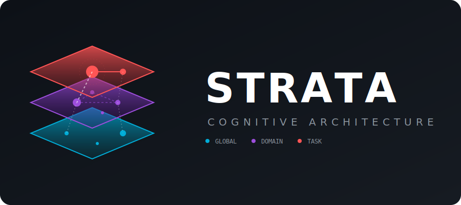
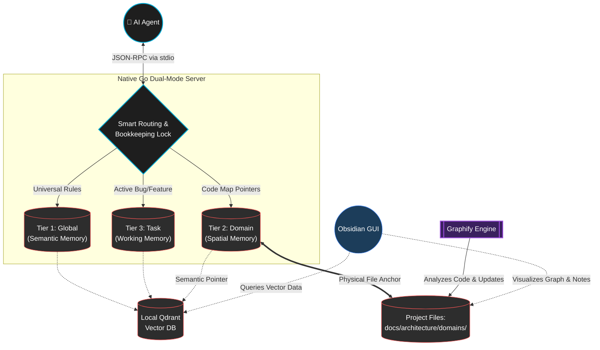

<div align="center">
  
</div>

<br/>

[](https://golang.org/)
[](https://modelcontextprotocol.io/)
[](https://qdrant.tech/)
[](https://opensource.org/licenses/MIT)

Strata is a high-performance, tool-agnostic Model Context Protocol (MCP) server that fundamentally changes how AI coding agents (like OpenCode, Claude, Cursor, and GitHub Copilot) remember project context. Written in native Go, it replaces fragile markdown trackers (`MEMORY.md`) with a deterministic, local-first vector database partitioned into a **3-Tier Cognitive Architecture**. 

Integrated seamlessly with **Graphify**, Strata maps semantic business axioms directly to the structural codebase, closing the cognitive gap between *what* code does and *why* it was written.

---

## 🔬 The Science: Why Traditional AI Memory Fails

Current agentic workflows suffer from severe context degradation due to a fundamental misunderstanding of how memory should be structured. Simply dumping vector search results into an LLM's context window leads to cognitive overload and hallucinations.

### 1. The Semantic vs. Structural Disconnect
Traditional static analysis tools (like AST parsers) map *code dependencies* and *call graphs*, but they are completely blind to *project knowledge*, *feature requirements*, and *axiomatic constraints*. The problem domain ("Reject mutilated fish") is structurally disconnected from the programming domain (`parser.go`).
* **The Strata + Graphify Fix:** According to the theory of program comprehension (*Brooks, 1983*), understanding code requires mapping the problem domain to the structural domain. Strata uses **Graphify** to create a knowledge graph that explicitly draws edges between markdown narratives (the rules) and the code files (the implementations), bridging the gap between axioms and execution.

### 2. The "Lost in the Middle" Phenomenon
Research demonstrates that LLMs have a U-shaped performance curve when retrieving information from long contexts. They remember the beginning and end of a prompt but catastrophically fail to retrieve information buried in the middle (*Liu et al., 2023*). 
* **The Strata Fix:** Strata enforces **Compact Reading**. Instead of dumping full documents into the context window, Tier 2 memory returns exact file pointers and line numbers. The agent is forced to read only the specific paragraph needed, minimizing context noise and preventing attention-mechanism dilution.

### 3. The Absence of Spatial Anchoring
Human memory relies on the hippocampus to create "Cognitive Maps"—spatial frameworks where memories are anchored to specific physical or conceptual locations (*O'Keefe & Nadel, 1978*). AI agents typically use flat vector databases, meaning a rule about frontend rendering might accidentally pollute a backend database task because they semantically overlap.
* **The Strata Fix:** Strata implements a **Pointer-Wiki Hybrid**. Domain rules are spatially anchored to specific directories (e.g., `docs/architecture/domains/`). The vector database stores a semantic pointer *to the physical file*. This forces the agent to traverse the project's spatial hierarchy, grounding its understanding in your codebase structure.

### 4. Semantic vs. Episodic Interference
Cognitive science divides long-term memory into **Semantic** (general facts/rules) and **Episodic** (specific events/tasks) (*Tulving, 1972*). Forcing an AI to process global infrastructure rules mixed with a temporary bug-fix context creates catastrophic interference.
* **The Strata Fix:** Strata rigidly partitions the database into Global, Domain, and Task namespaces (The 3 Tiers), ensuring the AI only retrieves the exact type of memory required for the current cognitive load.

---

## 🏗️ The 3-Tier Architecture

Strata maps directly to human cognitive models to provide agents with perfect, interference-free recall.



1. **Global (Tier 1):** Company-wide constraints and infrastructure mandates.
2. **Domain (Tier 2):** Project-specific rules and API contracts. Utilizes the *Pointer-Wiki* constraint: memories are hyper-specific references (`{"file": "docs/...", "lines": "42-49"}`) to physical architecture files.
3. **Task (Tier 3):** Ephemeral context for active bug fixes or feature branches.

---

## ✨ Features: Transparent & Autonomous Memory

> 💡 **Want to see Strata in action?** Check out the [Strata UI User Guide](docs/UI_GUIDE.md) for screenshots of the Obsidian Sidebar Inspector, Right-Click Context Tools, and the auto-generated Visual MemorySpace Canvas.

Strata isn't just a database; it is an active cognitive loop. 

* **Human Oversight & Curation:** While agents are highly autonomous, you retain ultimate control. Because Tier 2 memory is grounded in standard physical Markdown files (`docs/architecture/domains/`), you can directly edit, review, and curate the knowledge graph using Obsidian, VSCode, or any text editor. Strata respects explicit human-written constraints as the ultimate source of truth.
* **Autonomous Self-Healing (CRUD):** Agents using Strata are instructed to actively prune their own brains. If an agent detects a hallucinated rule or an outdated architectural decision, it autonomously calls `strata_update_memory` or `strata_delete_memory` to maintain a single source of truth.
* **Live Visual Latent Space:** Because vectors are opaque, Strata makes them transparent. Agents autonomously call `strata_generate_canvas(vault_path)`. Strata reads the vector database and programmatically generates an `Obsidian .canvas` file, allowing humans to physically see and organize the AI's "brain" as a spatial graph.
* **Mass Ingestion & Graphing:** Point Strata at a folder via `strata_ingest_directory`. The Go server intelligently chunks markdown by paragraph, paces requests to your local LLM embedder, and maps your architecture into vector space instantly. Coupled with Graphify, this overlays knowledge communities onto raw code.
* **Dual-Mode Architecture:** The native Go binary runs the MCP protocol over `stdio` for your agents, while simultaneously spinning up an HTTP REST Server (`localhost:8005`). External UIs (like Obsidian plugins) interact with the exact same memory mesh without duplicating vector math.

---

## 🚀 Getting Started

Strata is completely tool-agnostic. It integrates with the standard `~/.agents/` specification and registers directly into your AI client's configuration.

### Prerequisites

> **Philosophy: Batteries Included, Cloud Ready.** Strata is designed as a local-first, self-contained cognitive architecture to ensure absolute privacy and zero latency. However, it does not preclude utilizing hosted or cloud-based solutions—simply update the configuration to point to your preferred remote endpoints.

1. **Embedder:** An OpenAI-compatible embedding endpoint (e.g., local Llama.cpp/Ollama on `localhost:8004`, or a hosted provider like OpenAI).
2. **Vector Database:** A Qdrant instance (running locally on `localhost:6333` or via Qdrant Cloud).

### Installation

Clone the repository and run the automated installer. The installer uses a pre-compiled native binary, sets up global symlinks, builds the native OpenCode TypeScript plugin, and patches OpenCode's configuration automatically—**no Go toolchain required**. If you need to build from source for a different architecture, simply run `./build.sh` before `./install.sh`.

```bash
git clone https://github.com/your-username/strata.git ~/Documents/strata
cd ~/Documents/strata/mcp
./install.sh
```

**What the installer does:**
1. Installs the Go `strata-mcp` binary to `~/.local/bin/strata-mcp`.
2. Links the universal `SKILL.md` to `~/.agents/skills/strata`.
3. Builds and globally links the `opencode-strata` TypeScript plugin.
4. Registers both the MCP server and the plugin in `~/.config/opencode/opencode.json`.

### Configuration
The installer creates a default configuration at `~/.config/strata/config.json`. Modify this to point to your specific local LLM and database ports:

```json
{
  "embedder_url": "http://localhost:8004/v1/embeddings",
  "embedder_model": "nomic-embed-text-v1.5.f16.gguf",
  "embedder_api_key": "sk-local",
  "qdrant_url": "http://localhost:6333",
  "qdrant_collection": "strata",
  "http_port": "8005"
}
```

### OpenCode Agent Configuration

The Strata installation includes the `strata-task-agent`. To ensure this agent runs optimally, you should configure it to use a fast, low-cost, code-oriented model in your `~/.config/opencode/opencode.json` file. 

Add the `agent` block below to map `strata-task-agent` to a provider model of your choice (e.g., `github-copilot/gpt-4o`, `anthropic/claude-3-haiku-20240307`, or `openai/gpt-4o-mini`):

```json
  "agent": {
    "strata-task-agent": {
      "model": "github-copilot/gpt-4o"
    }
  }
```

---

## 🛠️ MCP Tool Reference

Once installed, your AI agent automatically gains access to the following tools:

| Tool Name | Description |
| :--- | :--- |
| `strata_add_memory` | Store a new architectural rule, project pattern, or task insight. |
| `strata_search_memory` | Semantic search across the 3 Tiers to enforce architectural compliance. |
| `strata_update_memory` | Overwrite an existing memory to fix hallucinations or update obsolete rules. |
| `strata_delete_memory` | Prune dead context from the latent space. |
| `strata_generate_canvas` | Autonomously render the vector database into an Obsidian spatial graph. |
| `strata_ingest_directory` | Batch-embed an entire architectural documentation folder. |
| `strata_dump_db` | Export the entire vector database to a JSON file for backup and portability. |

---

## 🏛️ Shoulders of Giants

Strata represents a synthesis of cognitive science theories and foundational open-source engineering. This project would not exist without the pioneering work of the following researchers and projects:

* **[Graphify](https://graphify.net/):** The knowledge graph engine that turns flat code bases and documentation into clustered, edge-mapped conceptual communities.
* **[Qdrant](https://qdrant.tech/):** The incredibly fast and reliable Rust-based vector search engine that powers the underlying memory mesh.
* **[LLM-WIKI Concept](https://gist.github.com/karpathy/442a6bf555914893e9891c11519de94f):** The architectural pattern of storing narrative knowledge in hyper-linked Markdown while giving the AI specific "Pointer-Wiki" search capabilities to prevent context bloat.

### Scientific Literature
* Brooks, R. (1983). *Towards a theory of the comprehension of computer programs*. International Journal of Man-Machine Studies.
* Liu, N. F., Lin, K., Hewitt, J., Paranjape, A., Bevilacqua, M., Petroni, F., & Liang, P. (2023). *Lost in the Middle: How Language Models Use Long Contexts*. arXiv:2307.03172.
* O'Keefe, J., & Nadel, L. (1978). *The hippocampus as a cognitive map*. Oxford: Clarendon Press.
* Tulving, E. (1972). *Episodic and semantic memory*. In E. Tulving & W. Donaldson (Eds.), *Organization of memory*. Academic Press.

## License
MIT License. See the `LICENSE` file for details. I wrote it, you can use it, keep it, close source it, whatever—just don't sue me!

### (Optional) 🐳 Infrastructure Setup via Podman
If you don't already have Qdrant and an Embedder running on your machine, Strata provides a ready-to-use `podman-compose.yml` to spin up the required local infrastructure instantly:

```bash
cd ~/Documents/strata
podman-compose up -d
```
*Note: The example compose file uses Ollama for embeddings. Ensure your `~/.config/strata/config.json` embedder URL points to `http://localhost:8004/api/embeddings` if using this setup.*
