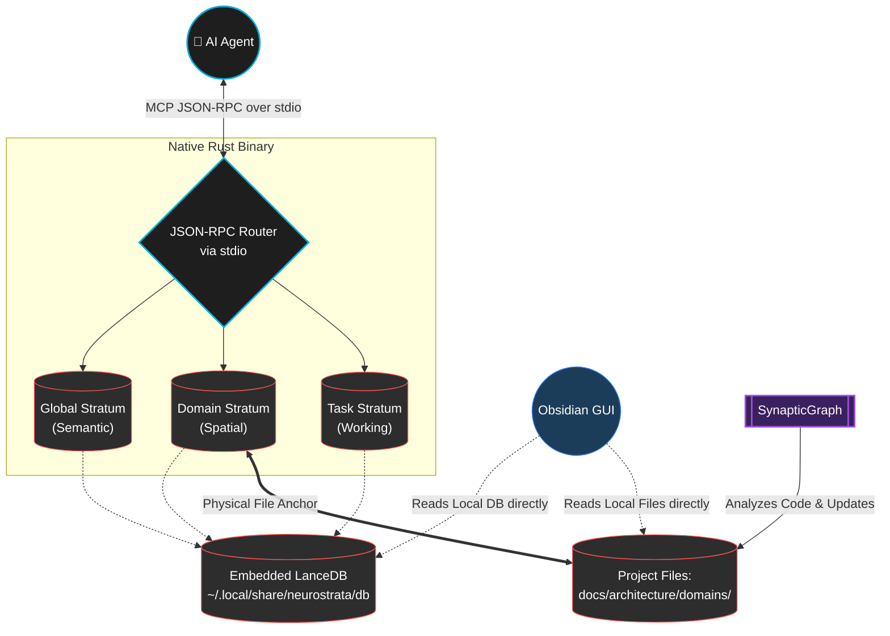

# 🧠 NeuroStrata
**The Long-Term Memory Layer for AI Coding Agents**

[](https://www.rust-lang.org/)
[](https://modelcontextprotocol.io/)
[](https://lancedb.com/)
[](https://opensource.org/licenses/MIT)

**Stop re-explaining your stack to your AI every time you open a new chat.**

NeuroStrata is a zero-config, local-first Model Context Protocol (MCP) server that gives your AI coding agents (Claude Desktop, Cursor, OpenCode, Copilot) a permanent, hierarchical memory across all your projects. 

If you are tired of spending 20 minutes context-loading every new chat, only for the agent to hallucinate library choices, ignore your architectural rules, or forget how your specific API works because it fell out of the context window—NeuroStrata is the permanent fix.

It doesn’t just blindly dump Markdown into a prompt. NeuroStrata is powered by **SynapticGraph**, a biologically-inspired **Dual-Track Bi-Temporal Graph Memory System** written entirely in Rust. It utilizes an embedded LanceDB vector store and full-text search (BM25 via Tantivy) to ensure your AI remembers exactly *what* to do, *how* to do it, and *why* you built it that way.

---

## 🌟 Why NeuroStrata Wins: The Zero-Overhead Advantage

* **Zero Network Attack Surface:** There are no REST APIs. There are no WebSockets. There is no MQTT broker, and there are no exposed localhost ports. NeuroStrata communicates purely over standard input/output (`stdio`) using the official MCP JSON-RPC spec. It is a secure, offline, single compiled Rust binary.
* **Embedded LanceDB & Tantivy:** No Docker containers to manage and no remote databases to pay for. The entire vector database and full-text search index runs embedded inside the Rust binary. It just works.
* **The "Pointer-Wiki" Architecture:** Standard RAG systems dump 50-page architecture documents into the LLM context window, which destroys reasoning performance and racks up API costs. NeuroStrata's **SynapticGraph** hands the agent a semantic *pointer*—a hyper-specific **Engram** (e.g., `docs/architecture/sync.md`, Lines 42-49). The agent only reads the bytes it needs to solve the problem.
* **Eidetic Recall & Instant Grounding:** Instead of wasting tokens blindly searching a new repository, agents instantly retrieve the top-5 highest-weighted, active Engrams for any project. This **Eidetic Recall** perfectly grounds an agent the exact second a chat session begins.
* **Visualize AI Memory Locally:** Because NeuroStrata simply writes to a local `.NeuroStrata/db` directory, our native **Obsidian Plugin** can read the database directly from disk. You can visually render exactly what your AI "knows" into a 2D spatial canvas in real-time, and seamlessly curate, edit, or **Synaptically Prune** the AI's memory with a right-click—all without a network connection.

---

## 🧬 Biological Nomenclature ↔ Engineering Primitives

NeuroStrata uses cognitive metaphors to map how software actually evolves. Here is the translation to actual engineering concepts:

| Biological Term | Engineering Primitive | Description |
| :--- | :--- | :--- |
| **SynapticGraph** | **Knowledge Engine** | The core inference engine mapping semantic business axioms directly to your structural codebase, traversing edges to identify connected architecture. |
| **Engram** | **Vector Row** | A single memory record in LanceDB containing text, embeddings, metadata, domain tags, and optional graph edges linking it to other Engrams. |
| **Synaptic Pruning** | **Score Decay** | An access-based reinforcement algorithm (inspired by the Ebbinghaus Forgetting Curve). Unused rules naturally decay in retrieval rank over time. *They are never autonomously deleted.* |
| **Eidetic Recall** | **Boot-time Snapshot** | Instant retrieval of the top 5 highest-weighted, active Engrams for a project the exact second a new chat session begins, instantly grounding the agent. |
| **Tri-Strata Model** | **Namespace Tiers** | Strict partitioning of the database into Global (Company), Domain (Project), and Task (Issue) namespaces to prevent context contamination. |
| **Episodic Buffer** | **Rolling Log Files** | A silent background log written to `.NeuroStrata/sessions/` capturing all conversational context and architectural pivots so nothing is lost when a chat closes. |

---

## 🔬 The Science: Why Traditional AI Memory Fails

Current agentic workflows suffer from severe context degradation due to a fundamental misunderstanding of how memory should be structured. 

### 1. The "Lost in the Middle" Phenomenon
Research demonstrates that LLMs have a U-shaped performance curve when retrieving information from long contexts. They remember the beginning and end of a prompt but catastrophically fail to retrieve information buried in the middle (*Liu et al., 2023*). 
* **The NeuroStrata Fix (Pointer-Wiki):** NeuroStrata enforces **Compact Reading**. Instead of dumping full documents into the context window, memory returns exact file pointers and line numbers. The agent is forced to read only the specific paragraph needed, minimizing context noise and preventing attention-mechanism dilution.

### 2. Semantic vs. Episodic Interference
Cognitive science divides long-term memory into **Semantic** (general facts/rules) and **Episodic** (specific events/tasks) (*Tulving, 1972*). Forcing an AI to process global infrastructure rules mixed with a temporary bug-fix context creates catastrophic interference.
* **The NeuroStrata Fix (Tri-Strata Model):** NeuroStrata rigidly partitions the database into Global, Domain, and Task namespaces, ensuring the AI only retrieves the exact type of memory required for the current cognitive load.

### 3. The Absence of Spatial Anchoring
Human memory relies on the hippocampus to create "Cognitive Maps"—spatial frameworks where memories are anchored to specific physical or conceptual locations (*O'Keefe & Nadel, 1978*). AI agents typically use flat vector databases, meaning a rule about frontend rendering might accidentally pollute a backend database task because they semantically overlap.
* **The NeuroStrata Fix (Spatial Grounding):** Domain rules are spatially anchored to specific physical directories (e.g., `docs/architecture/domains/`). The vector database stores a semantic pointer *to the physical file*. This forces the agent to traverse the project's spatial hierarchy, grounding its understanding in your codebase structure.

### 4. The Semantic vs. Structural Disconnect
Traditional static analysis tools map *code dependencies* and *call graphs*, but they are completely blind to *project knowledge* and *axiomatic constraints*. 
* **The NeuroStrata Fix (SynapticGraph):** According to the theory of program comprehension (*Brooks, 1983*), understanding code requires mapping the problem domain to the structural domain. NeuroStrata's internal **SynapticGraph engine** explicitly maps architectural documents to the code files (the implementations), bridging the gap between business axioms and execution.

---

## 🏗️ The Tri-Strata Model Architecture

NeuroStrata maps directly to human cognitive models to provide agents with perfect, interference-free recall via a secure, local-only architecture.



1. **Global Stratum (Tier 1):** Company-wide constraints and infrastructure mandates (e.g., "Always use `podman` instead of `docker`").
2. **Domain Stratum (Tier 2):** Project-specific rules and API contracts. Utilizes the SynapticGraph pointer constraint: Engrams are hyper-specific references (`{"file": "docs/...", "lines": "42-49"}`) to physical architecture files.
3. **Task Stratum (Tier 3):** Ephemeral context for active bug fixes or feature branches.

---

## 📝 The Episodic Buffer & Operator Controls

To prevent the loss of critical architectural decisions made during ad-hoc conversations, NeuroStrata enforces an **Episodic Buffer**. Agents are instructed to silently use the `neurostrata_append_log` tool in the background as they work, writing to a local `.NeuroStrata/sessions/` directory.

* **Grep-able Waypoints:** When a user changes topics (e.g., from "database refactor" to "UI design"), the agent tags the log entry. The Rust server injects highly structured `### 🔄 Topic Switch` markers.
* **Compact Recovery:** If an agent ever loses context, it is instructed to run a two-pass recovery: `grep` for the Topic Switch waypoints to find the general discussion area, and then use the `read` tool with exact line offsets to instantly recover the forgotten context without reading massive files.
* **Operator Safety Controls:** Log files automatically roll over at 500KB. To prevent bounded disk growth or the accidental logging of sensitive secrets, you can configure retention policies or disable the Episodic Buffer entirely via `~/.config/neurostrata/config.json`. *Never paste raw API keys into an AI chat if the buffer is active.*

---

## 🚀 Getting Started

NeuroStrata is tool-agnostic. It integrates with the standard `~/.agents/` specification and registers directly into your AI client's configuration (like Claude Desktop or OpenCode).

### Prerequisites
1. **Embedder:** An OpenAI-compatible embedding endpoint (e.g., a local Llama.cpp/Ollama on `localhost:8004`, or a hosted provider like OpenAI).
2. **Vector Database:** None! LanceDB runs entirely embedded within the Rust binary. 

### Installation

Clone the repository and run the automated installer. The installer uses a pre-compiled native binary, sets up global symlinks, and patches the client's configuration automatically—**no Rust toolchain required**.

```bash
git clone https://github.com/your-username/NeuroStrata.git ~/Documents/neurostrata
cd ~/Documents/neurostrata
./install.sh
```

**What the installer does:**
1. Installs the Rust `neurostrata-mcp` binary to `~/.local/bin/neurostrata-mcp`.
2. Links the universal `SKILL.md` to `~/.agents/skills/neurostrata`.
3. Registers the MCP server in your client's local configuration (e.g. `~/.config/opencode/opencode.json`).

### Configuration
The installer creates a default configuration at `~/.config/neurostrata/config.json`. Modify this to point to your specific local LLM embedder:

```json
{
  "db_path": "~/.local/share/neurostrata/db",
  "embedder_url": "http://localhost:8004/v1/embeddings",
  "embedder_api_key": "YOUR_API_KEY_OR_BLANK_FOR_LOCAL",
  "buffer_retention_days": 30
}
```

### Visualizing Memory with Obsidian
Because NeuroStrata writes standard local files and an embedded LanceDB database, you can visually curate the AI's memory using Obsidian without running any network servers:
1. Create a new plugin folder: `mkdir -p .obsidian/plugins/neurostrata-plugin`
2. Copy the pre-compiled plugin: `cp -r ~/Documents/neurostrata/plugins/obsidian/obsidian-neurostrata/* .obsidian/plugins/neurostrata-plugin/`
3. In Obsidian, enable the NeuroStrata plugin to view the live graph.

---

## 🛠️ MCP Tool Reference

Once installed, your AI agent automatically gains access to the following tools over `stdio`:

| Tool Name | Description |
| :--- | :--- |
| `neurostrata_add_memory` | Store a new architectural rule, project pattern, or task insight. |
| `neurostrata_search_memory` | Semantic search across the 3 Tiers to enforce architectural compliance. |
| `neurostrata_update_memory` | Overwrite an existing memory to fix hallucinations or update obsolete rules. |
| `neurostrata_delete_memory` | Hard-delete dead context from the latent space (Manual verification required). |
| `neurostrata_generate_canvas` | Autonomously render the vector database into an Obsidian `.canvas` spatial graph. |
| `neurostrata_ingest_directory` | Batch-embed an entire architectural documentation folder. |
| `neurostrata_dump_db` | Export the entire vector database to a JSON file for backup and portability. |

## 🛡️ Security & Compliance

NeuroStrata is actively hardened against the **OWASP Top 10 for LLM Applications** and common AI red-teaming vectors:
- **Zero Network Attack Surface (Mitigates LLM07):** NeuroStrata is a pure `stdio` MCP server. It listens on zero ports and has no external APIs, neutralizing remote RCE and plugin exploitation vectors.
- **Active Secret Scrubbing (Mitigates LLM06):** The Rust backend actively scans memory payloads for high-entropy secrets (API keys, passwords, JWTs) and explicitly rejects insertions, forcing the agent into a "Redaction Loop" to prevent permanent context contamination.
- **Role-Based Memory Access (Mitigates LLM08):** Destructive actions (`neurostrata_delete_memory`) are strictly restricted. Task sub-agents cannot delete memories or drop the database, ensuring only the manager agent can curate the vector space.
- **Resilient Soft Locks (Mitigates LLM09):** To combat context degradation and "happy path" tunnel vision, NeuroStrata enforces memory extraction through OS-level Git hooks (Pre-Push Behavioral Forcing) rather than relying solely on fragile system prompts.

## License
MIT License. See the `LICENSE` file for details. I wrote it, you can use it, keep it, close source it, whatever—just don't sue me!
