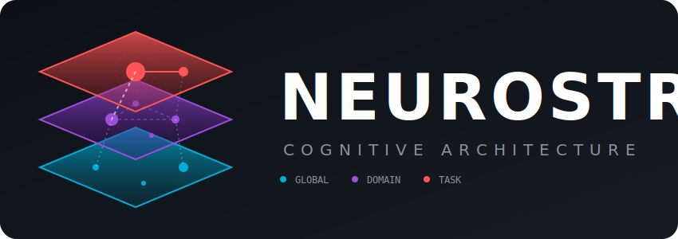
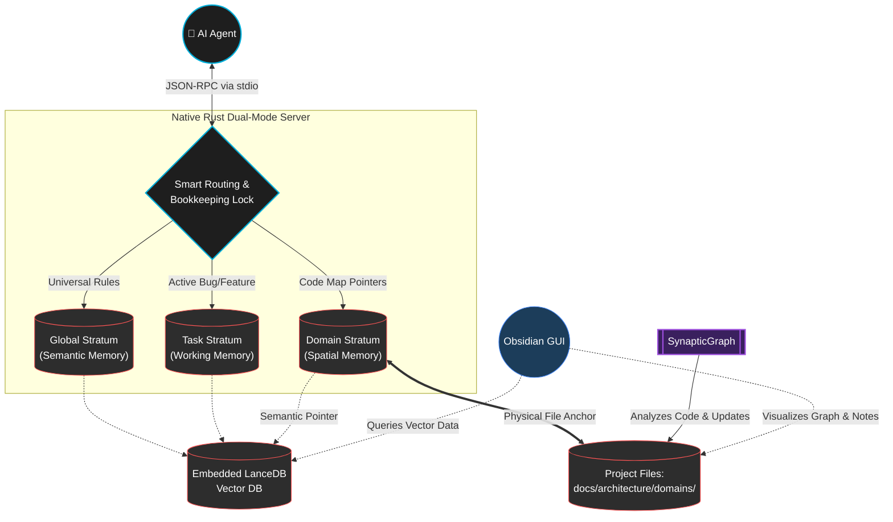

<div align="center">
  
</div>

<br/>

[](https://www.rust-lang.org/)
[](https://modelcontextprotocol.io/)
[](https://lancedb.com/)
[](https://opensource.org/licenses/MIT)

# NeuroStrata: The Long-Term Memory Layer for AI Coding Agents

**Stop re-explaining your stack to your AI every time you open a new chat.**

NeuroStrata is a zero-config, local-first Model Context Protocol (MCP) server that gives your AI coding agents (like Claude Desktop, Cursor, OpenCode, and Copilot) a permanent, hierarchical memory across all your projects.

If you're tired of AI agents hallucinating library choices, ignoring your architectural rules, or forgetting how your specific API works because it fell out of the context window—NeuroStrata is the fix. 

### Why Developers Love It:
*   **Zero-Overhead Embedded Rust:** No Docker containers to manage, no remote databases to pay for, no Python dependency hell. NeuroStrata ships as a single compiled Rust binary with an embedded **LanceDB** vector store and an internal **MQTT** broker. It just runs.
*   **No REST APIs, No Port Conflicts:** We completely stripped out HTTP/REST. NeuroStrata communicates purely via standard MCP JSON-RPC over `stdio` for agents, and fast, multiplexed MQTT over WebSockets for UI clients.
*   **"Pointer-Wiki" Architecture:** Instead of dumping 50-page architecture documents into the LLM context window (which destroys performance and racks up API costs), NeuroStrata hands the agent a semantic *pointer* (e.g., `docs/architecture/sync.md`, Lines 42-49). The agent only reads the bytes it needs.
*   **Visualize AI Memory:** Most RAG systems are opaque black boxes. NeuroStrata includes a native **Obsidian Plugin** that connects via WebSockets to visually render exactly what your AI "knows" into a 2D spatial canvas in real-time. You can seamlessly curate, edit, and delete the AI's memory with a right-click.

Integrated seamlessly with **SynapticGraph**, NeuroStrata maps semantic business axioms directly to the structural codebase, closing the cognitive gap between *what* code does and *why* it was written.

---

## 🌟 Why We Are Ahead of the Pack: The Cognitive Architecture

While standard RAG systems and basic agent frameworks struggle with context bloat, hallucinated architecture, and ephemeral memory, NeuroStrata implements a **Dual-Track Bi-Temporal Graph Memory System** natively in Rust. 

We don't just store flat vectors; we map how software actually evolves using 6 core cognitive mechanics:

1. **Semantic Graph Edges (Relational Traversal):** Memories aren't isolated. Our LanceDB schema supports directional edges (`related_to`). When an agent updates a database rule, it instantly traverses the graph to identify connected API contracts, preventing cascading regressions.
2. **Immutable Temporal Audit Trail:** Agents never overwrite history. Using `valid_from` and `valid_to` timestamps, NeuroStrata soft-deletes outdated rules. This bi-temporal design maintains a perfect, queryable audit trail of how your architecture evolves.
3. **Synaptic Pruning & Gain:** We apply an access-based reinforcement algorithm (inspired by the Ebbinghaus Forgetting Curve) on top of standard vector distance. Frequently used Engrams gain a mathematical boost and float to the top of the context window, while unused, outdated rules naturally decay.
4. **Domain-Isolated Knowledge Shelves:** To prevent massive context hallucinations, NeuroStrata categorizes vectors into explicit declarative `domains` (e.g., `frontend`, `database`, `devops`). Agents compartmentalize their focus, shrinking the search space and ensuring high-fidelity retrieval.
5. **Eidetic Recall (Cognitive Snapshots):** Instead of wasting tokens blindly searching a new repository, agents instantly retrieve the top-5 highest-weighted, active Engrams for any project. This perfectly grounds an agent the second a session begins.
6. **Reciprocal Rank Fusion (Hybrid Retrieval):** Dense vectors are terrible at finding exact variable names. NeuroStrata's Rust backend utilizes `tantivy` to merge dense semantic search with exact Full-Text Search (BM25). Agents recall both the conceptual "gist" and the exact "verbatim" code syntax simultaneously.

*For a deep dive into the 10 mechanics powering the system, read the [Cognitive Architecture Whitepaper](docs/COGNITIVE_ARCHITECTURE.md).*

---

## 🔬 The Science: Why Traditional AI Memory Fails

Current agentic workflows suffer from severe context degradation due to a fundamental misunderstanding of how memory should be structured. Simply dumping vector search results into an LLM's context window leads to cognitive overload and hallucinations.

### 1. The Semantic vs. Structural Disconnect
Traditional static analysis tools map *code dependencies* and *call graphs*, but they are completely blind to *project knowledge*, *feature requirements*, and *axiomatic constraints*. The problem domain ("Reject mutilated fish") is structurally disconnected from the programming domain (`parser.go`).
* **The NeuroStrata + SynapticGraph Fix:** According to the theory of program comprehension (*Brooks, 1983*), understanding code requires mapping the problem domain to the structural domain. NeuroStrata uses **the internal SynapticGraph engine** to generate a knowledge graph that explicitly maps architectural documents to the code files (the implementations), bridging the gap between axioms and execution.

### 2. The "Lost in the Middle" Phenomenon
Research demonstrates that LLMs have a U-shaped performance curve when retrieving information from long contexts. They remember the beginning and end of a prompt but catastrophically fail to retrieve information buried in the middle (*Liu et al., 2023*). 
* **The NeuroStrata Fix:** NeuroStrata enforces **Compact Reading**. Instead of dumping full documents into the context window, Tier 2 memory returns exact file pointers and line numbers. The agent is forced to read only the specific paragraph needed, minimizing context noise and preventing attention-mechanism dilution.

### 3. The Absence of Spatial Anchoring
Human memory relies on the hippocampus to create "Cognitive Maps"—spatial frameworks where memories are anchored to specific physical or conceptual locations (*O'Keefe & Nadel, 1978*). AI agents typically use flat vector databases, meaning a rule about frontend rendering might accidentally pollute a backend database task because they semantically overlap.
* **The NeuroStrata Fix:** NeuroStrata integrates semantic rules directly into **SynapticGraph**. Domain rules are spatially anchored to specific directories (e.g., `docs/architecture/domains/`). The vector database stores a semantic pointer *to the physical file*. This forces the agent to traverse the project's spatial hierarchy, grounding its understanding in your codebase structure.

### 4. Semantic vs. Episodic Interference
Cognitive science divides long-term memory into **Semantic** (general facts/rules) and **Episodic** (specific events/tasks) (*Tulving, 1972*). Forcing an AI to process global infrastructure rules mixed with a temporary bug-fix context creates catastrophic interference.
* **The NeuroStrata Fix:** NeuroStrata rigidly partitions the database into **The Tri-Strata Model** (Global, Domain, and Task namespaces), ensuring the AI only retrieves the exact type of memory required for the current cognitive load.

---

## 🏗️ The Tri-Strata Model

NeuroStrata maps directly to human cognitive models to provide agents with perfect, interference-free recall.



1. **Global Stratum (Tier 1):** Company-wide constraints and infrastructure mandates.
2. **Domain Stratum (Tier 2):** Project-specific rules and API contracts. Utilizes the SynapticGraph pointer constraint: Engrams are hyper-specific references (`{"file": "docs/...", "lines": "42-49"}`) to physical architecture files.
3. **Task Stratum (Tier 3):** Ephemeral context for active bug fixes or feature branches.

---

## 📝 The Episodic Buffer

To prevent the loss of critical architectural decisions made during ad-hoc conversations, NeuroStrata enforces an **Episodic Buffer**. 

Instead of treating chat sessions as ephemeral or forcing annoying "Startup Protocols", the system maintains an invisible, rolling log (the Context Stream) in the `.neurostrata/sessions/` directory. 

* **The Mechanism:** Agents are instructed to silently use the `neurostrata_append_log` tool in the background as they work. The Rust server automatically manages file size, rolling logs over 500KB into timestamped archives.
* **Grep-able Waypoints:** When a user changes topics (e.g., from "database refactor" to "UI design"), the agent tags the log entry. The Rust server injects highly structured `### 🔄 Topic Switch` markers.
* **Recovery:** If an agent ever loses context due to compaction, it is instructed to run a two-pass recovery: `grep` for the Topic Switch waypoints to find the general discussion area, and then use the `read` tool with exact line offsets to instantly recover the forgotten context without reading massive files.

---

## ✨ Features: Transparent & Autonomous Memory

> 💡 **Want to see NeuroStrata in action?** Check out the [NeuroStrata UI User Guide](docs/UI_GUIDE.md) for screenshots of the Obsidian Sidebar Inspector, Right-Click Context Tools, and the auto-generated Visual MemorySpace Canvas.

NeuroStrata isn't just a database; it is an active cognitive loop. 

* **Human Oversight & Curation:** While agents are highly autonomous, you retain ultimate control. Because the Domain Stratum is grounded in standard physical Markdown files (`docs/architecture/domains/`), you can directly edit, review, and curate the knowledge graph using Obsidian, VSCode, or any text editor. NeuroStrata respects explicit human-written constraints as the ultimate source of truth.
* **Autonomous Self-Healing (CRUD):** Agents using NeuroStrata are instructed to actively prune their own brains. If an agent detects a hallucinated rule or an outdated architectural decision, it autonomously calls `neurostrata_update_memory` or `neurostrata_delete_memory` to maintain a single source of truth.
* **Live Visual Latent Space:** Because vectors are opaque, NeuroStrata makes them transparent. Agents autonomously call `neurostrata_generate_canvas(vault_path)`. NeuroStrata reads the vector database and programmatically generates an `Obsidian .canvas` file, allowing humans to physically see and organize the AI's "brain" as a spatial graph.
* **Mass Ingestion & Graphing:** Point NeuroStrata at a folder via `neurostrata_ingest_directory`. The Rust server intelligently chunks markdown by paragraph, paces requests to your local LLM embedder, and maps your architecture into vector space instantly.
* **Dual-Mode Architecture:** The native Rust binary runs the MCP protocol over `stdio` for your agents, while simultaneously spinning up an HTTP REST Server (`localhost:8005`). External UIs (like Obsidian plugins) interact with the exact same memory mesh without duplicating vector math.

---

## 🚀 Getting Started

NeuroStrata is completely tool-agnostic. It integrates with the standard `~/.agents/` specification and registers directly into your AI client's configuration.

### Prerequisites

> **Philosophy: Batteries Included, Cloud Ready.** NeuroStrata is designed as a local-first, self-contained cognitive architecture to ensure absolute privacy and zero latency. However, it does not preclude utilizing hosted or cloud-based solutions—simply update the configuration to point to your preferred remote endpoints.

1. **Embedder:** An OpenAI-compatible embedding endpoint (e.g., local Llama.cpp/Ollama on `localhost:8004`, or a hosted provider like OpenAI).
2. **Vector Database:** None! LanceDB runs entirely embedded within the Rust binary. No external database instance is required.

#### 💡 Bundled Agent Tooling
To ensure your AI agents have the best possible environment out of the box, the automated installers will automatically provision the following CLI tools alongside NeuroStrata:
* **[Beads (bd)](https://github.com/beads/bd):** A local, git-backed issue tracker used by agents for task coordination. 

If you wish to visually monitor what the agents are doing with the `bd` CLI, you can optionally install the **[BeadBoard Dashboard](https://github.com/beads/beadboard)** alongside it.
Similarly, if you want to visually manage and curate the AI's memory vectors and spatial graph, we highly recommend installing **[Obsidian](https://obsidian.md/)** and enabling the NeuroStrata Community Plugin.

### Installation

Clone the repository and run the automated installer. The installer uses a pre-compiled native binary, sets up global symlinks, builds the native TypeScript plugin for compatible clients (like OpenCode), and patches the client's configuration automatically—**no Rust toolchain required**. If you need to build from source for a different architecture, simply run `./build.sh` before `./install.sh`.

```bash
git clone https://github.com/your-username/NeuroStrata.git ~/Documents/neurostrata
cd ~/Documents/neurostrata
./install.sh
```

**What the installer does:**
1. Installs the Rust `neurostrata-mcp` binary to `~/.local/bin/neurostrata-mcp`.
2. Links the universal `SKILL.md` to `~/.agents/skills/neurostrata`.
3. Builds and globally links the `opencode-neurostrata` TypeScript plugin.
4. Registers both the MCP server and the plugin in your client's local configuration (e.g. `~/.config/opencode/opencode.json`).

### Optional: Obsidian Plugin Installation
Because the NeuroStrata Obsidian plugin is not yet published to the official Community Plugins store, you must install it manually into your vault:

1. Open your Obsidian vault directory in your terminal.
2. Create a new plugin folder: `mkdir -p .obsidian/plugins/neurostrata-plugin`
3. Copy the pre-compiled plugin files from the NeuroStrata repository into your vault:
   ```bash
   cp -r ~/Documents/neurostrata/plugins/obsidian/obsidian-neurostrata/* .obsidian/plugins/neurostrata-plugin/
   ```
4. In Obsidian, go to **Settings > Community Plugins**, disable **Safe Mode**, and toggle the **NeuroStrata** plugin to enable it.

### Configuration
The installer creates a default configuration at `~/.config/neurostrata/config.json`. Modify this to point to your specific local LLM and database ports:

```json
{
  "db_path": "~/.local/share/neurostrata/db"
}
```

### Sub-Agent Configuration

The NeuroStrata installation includes the `NeuroStrata-Task`. To ensure this agent runs optimally, you should configure your AI client to map this sub-agent to a fast, low-cost, code-oriented model.

For example, if you are using OpenCode, add the `agent` block below to `~/.config/opencode/opencode.json`:

```json
  "agent": {
    "NeuroStrata-Task": {
      "model": "github-copilot/gpt-4o"
    }
  }
```

---

## 🛠️ MCP Tool Reference

Once installed, your AI agent automatically gains access to the following tools:

| Tool Name | Description |
| :--- | :--- |
| `neurostrata_add_memory` | Store a new architectural rule, project pattern, or task insight. |
| `neurostrata_search_memory` | Semantic search across the 3 Tiers to enforce architectural compliance. |
| `neurostrata_update_memory` | Overwrite an existing memory to fix hallucinations or update obsolete rules. |
| `neurostrata_delete_memory` | Prune dead context from the latent space. |
| `neurostrata_generate_canvas` | Autonomously render the vector database into an Obsidian spatial graph. |
| `neurostrata_ingest_directory` | Batch-embed an entire architectural documentation folder. |
| `neurostrata_dump_db` | Export the entire vector database to a JSON file for backup and portability. |

---

## 🏛️ Shoulders of Giants

NeuroStrata represents a synthesis of cognitive science theories and foundational open-source engineering. This project would not exist without the pioneering work of the following researchers and projects:

* **[Beads (bd)](https://github.com/beads/bd):** A local, git-backed issue tracker that serves as the primary execution and orchestration layer for agents. While NeuroStrata strictly manages the *knowledge state*, Beads manages the *execution state* (ensuring no code is written without a claimed ticket).
* **[LanceDB](https://lancedb.com/):** An open-source, embedded vector database designed for AI. It runs seamlessly inside the Rust binary, offering extreme performance with zero infrastructure overhead.

### Scientific Literature
* Brooks, R. (1983). *Towards a theory of the comprehension of computer programs*. International Journal of Man-Machine Studies.
* Liu, N. F., Lin, K., Hewitt, J., Paranjape, A., Bevilacqua, M., Petroni, F., & Liang, P. (2023). *Lost in the Middle: How Language Models Use Long Contexts*. arXiv:2307.03172.
* O'Keefe, J., & Nadel, L. (1978). *The hippocampus as a cognitive map*. Oxford: Clarendon Press.
* Tulving, E. (1972). *Episodic and semantic memory*. In E. Tulving & W. Donaldson (Eds.), *Organization of memory*. Academic Press.

## License
MIT License. See the `LICENSE` file for details. I wrote it, you can use it, keep it, close source it, whatever—just don't sue me!
