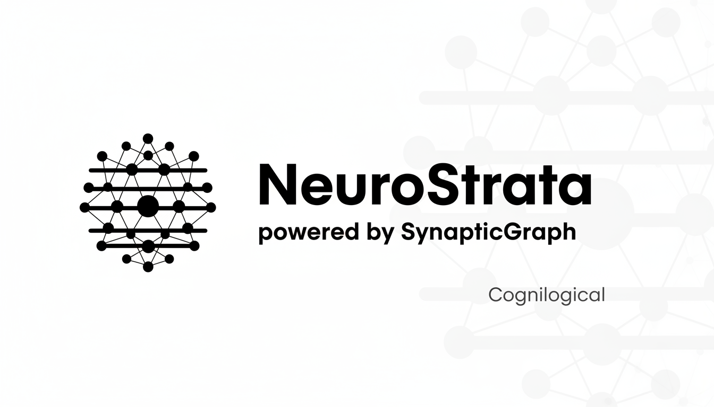
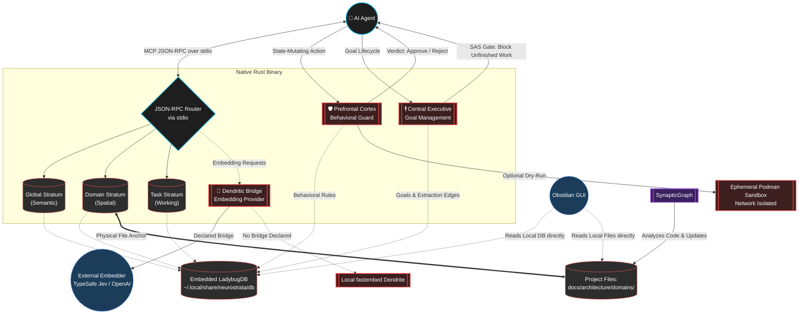

# 🧠 NeuroStrata


**The Long-Term Memory Layer for AI Coding Agents**

[](https://www.rust-lang.org/)
[](https://modelcontextprotocol.io/)
[](https://ladybugdb.com/)
[](https://opensource.org/licenses/MIT)

**Stop re-explaining your stack to your AI every time you open a new chat.**

NeuroStrata is a zero-config, local-first Model Context Protocol (MCP) server that gives your AI coding agents (Claude Desktop, Cursor, OpenCode, Copilot) a permanent, hierarchical memory across all your projects. 

If you are tired of spending 20 minutes context-loading every new chat, only for the agent to hallucinate library choices, ignore your architectural rules, or forget how your specific API works because it fell out of the context window—NeuroStrata is the permanent fix.

It doesn’t just blindly dump Markdown into a prompt. NeuroStrata is powered by **SynapticGraph**, a biologically-inspired **Dual-Track Bi-Temporal Graph Memory System** written entirely in Rust. It utilizes an embedded LadybugDB vector store and full-text search (BM25 via Tantivy) to ensure your AI remembers exactly *what* to do, *how* to do it, and *why* you built it that way.

That memory is now only the first organ. NeuroStrata is a **complete cognitive architecture** in four parts: **SynapticGraph** and **Engrams** for what the agent knows, a **Prefrontal Cortex** that intercepts state-mutating actions and validates them against your behavioral rules *before* they touch the disk, a **Central Executive** that holds the agent's Goals and refuses to let work finish before it has been consolidated into memory, and a **Dendritic Bridge** that lets external embedding providers deliver signals into the cortex — degrading to a fully local embedder the moment a bridge is not declared.

---

## 🌟 Why NeuroStrata Wins: The Zero-Overhead Advantage

* **Nothing Leaves The Machine:** There are no REST APIs to the outside world, no WebSockets, and no MQTT broker. Agents speak to NeuroStrata over standard input/output (`stdio`) using the official MCP JSON-RPC spec; a local daemon listens on `127.0.0.1:34343` for the GUI and for the stdio proxy, bound to loopback only. It is an offline, single compiled Rust binary.
* **Embedded LadybugDB & Tantivy:** No Docker containers to manage and no remote databases to pay for. The entire vector database and full-text search index runs embedded inside the Rust binary. It just works.
* **The "Pointer-Wiki" Architecture:** Standard RAG systems dump 50-page architecture documents into the LLM context window, which destroys reasoning performance and racks up API costs. NeuroStrata's **SynapticGraph** hands the agent a semantic *pointer*—a hyper-specific **Engram** (e.g., `docs/architecture/sync.md`, Lines 42-49). The agent only reads the bytes it needs to solve the problem.
* **Eidetic Recall & Instant Grounding:** Instead of wasting tokens blindly searching a new repository, agents instantly retrieve the top-5 highest-weighted, active Engrams for any project. This **Eidetic Recall** perfectly grounds an agent the exact second a chat session begins.
* **Visualize AI Memory Locally:** Because NeuroStrata simply writes to a local `.NeuroStrata/db` directory, our native **Obsidian Plugin** can read the database directly from disk. You can visually render exactly what your AI "knows" into a 2D spatial canvas in real-time, and seamlessly curate, edit, or **Synaptically Prune** the AI's memory with a right-click—all without a network connection.

---

## 🧬 Biological Nomenclature ↔ Engineering Primitives

NeuroStrata uses cognitive metaphors to map how software actually evolves. Here is the translation to actual engineering concepts:

| Biological Term | Engineering Primitive | Description |
| :--- | :--- | :--- |
| **SynapticGraph** | **Knowledge Engine** | The core inference engine mapping semantic business axioms directly to your structural codebase, traversing edges to identify connected architecture. |
| **Engram** | **Vector Row** | A single memory record in LadybugDB containing text, embeddings, metadata, domain tags, and optional graph edges linking it to other Engrams. |
| **Synaptic Pruning** | **Score Decay** | An access-based reinforcement algorithm (inspired by the Ebbinghaus Forgetting Curve). Unused rules naturally decay in retrieval rank over time. *They are never autonomously deleted.* |
| **Eidetic Recall** | **Boot-time Snapshot** | Instant retrieval of the top 5 highest-weighted, active Engrams for a project the exact second a new chat session begins, instantly grounding the agent. |
| **Tri-Strata Model** | **Namespace Tiers** | Strict partitioning of the database into Global (Company), Domain (Project), and Task (Issue) namespaces to prevent context contamination. |
| **Episodic Buffer** | **Rolling Log Files** | A silent background log written to `.NeuroStrata/sessions/` capturing all conversational context and architectural pivots so nothing is lost when a chat closes. |
| **Prefrontal Cortex** | **Behavioral Guard** | A structural executive module that intercepts state-mutating actions (bash, file writes) *before* execution, resolving them against behavioral rules by semantic similarity in LadybugDB, with an optional ephemeral Podman dry-run. |
| **Dendritic Bridge** | **Remote Embedder** | An external, OpenAI-compatible embedding endpoint that integrates signals from sources outside the cortex, with the local `fastembed` dendrite absorbing every request when no bridge is declared. |
| **Central Executive** | **Task Subsystem** | Goal lifecycle management — create, claim, gate, complete — driven by a hand-rolled state machine and one enforcement hook. Named for Baddeley's executive component of working memory: it decides what gets worked on and when work is genuinely finished. |
| **Goal** | **Task Record** | An Engram with `memory_type: "task"` — status, priority, assignee, and an append-only history in its metadata. Goals live in the same LadybugDB as everything else, so memory and task state can never decouple. |
| **Supervisory Attentional System** | **Task Gate** | Norman & Shallice's conflict monitor, realized as `neurostrata-mcp task gate --strict`: the pre-push hook refuses to let work leave the machine while Goals are unfinished or unconsolidated. |
| **Knowledge Consolidation** | **Done-Funnel (Lock 2)** | A Goal reaches `done` through exactly one guarded entrance — `neurostrata_task_complete` — which fails until the work has consolidated at least one Engram (an `EXTRACTED_FROM` edge). Experience is not allowed to evaporate. |
| **Action Initiation** | **Zero-Action Start** | No state-mutating action begins before a Goal exists and is claimed. The session snapshot says it first, every time. |
| **Working Memory** | **Goal History** | The append-only transition log and notes on each Goal — the Task Stratum made durable. Mid-task checkpoints ("the Breath") land here. |

---

## 🔬 The Science: Why Traditional AI Memory Fails

Current agentic workflows suffer from severe context degradation due to a fundamental misunderstanding of how memory should be structured. 

### 1. The "Lost in the Middle" Phenomenon
Research demonstrates that LLMs have a U-shaped performance curve when retrieving information from long contexts. They remember the beginning and end of a prompt but catastrophically fail to retrieve information buried in the middle (*Liu et al., 2023*). 
* **The NeuroStrata Fix (Pointer-Wiki):** NeuroStrata enforces **Compact Reading**. Instead of dumping full documents into the context window, memory returns exact file pointers and line numbers. The agent is forced to read only the specific paragraph needed, minimizing context noise and preventing attention-mechanism dilution.

### 2. Semantic vs. Episodic Interference
Cognitive science divides long-term memory into **Semantic** (general facts/rules) and **Episodic** (specific events/tasks) (*Tulving, 1972*). Forcing an AI to process global infrastructure rules mixed with a temporary bug-fix context creates catastrophic interference.
* **The NeuroStrata Fix (Tri-Strata Model):** NeuroStrata rigidly partitions the database into Global, Domain, and Task namespaces, ensuring the AI only retrieves the exact type of memory required for the current cognitive load.

### 3. The Absence of Spatial Anchoring
Human memory relies on the hippocampus to create "Cognitive Maps"—spatial frameworks where memories are anchored to specific physical or conceptual locations (*O'Keefe & Nadel, 1978*). AI agents typically use flat vector databases, meaning a rule about frontend rendering might accidentally pollute a backend database task because they semantically overlap.
* **The NeuroStrata Fix (Spatial Grounding):** Domain rules are spatially anchored to specific physical directories (e.g., `docs/architecture/domains/`). The vector database stores a semantic pointer *to the physical file*. This forces the agent to traverse the project's spatial hierarchy, grounding its understanding in your codebase structure.

### 4. The Semantic vs. Structural Disconnect
Traditional static analysis tools map *code dependencies* and *call graphs*, but they are completely blind to *project knowledge* and *axiomatic constraints*. 
* **The NeuroStrata Fix (SynapticGraph):** According to the theory of program comprehension (*Brooks, 1983*), understanding code requires mapping the problem domain to the structural domain. NeuroStrata's internal **SynapticGraph engine** explicitly maps architectural documents to the code files (the implementations), bridging the gap between business axioms and execution.

---

## 🏗️ The Tri-Strata Model Architecture

NeuroStrata maps directly to human cognitive models to provide agents with perfect, interference-free recall via a secure, local-only architecture.


```mermaid
graph TD
    Agent((🤖 AI Agent))
    
    subgraph NeuroStrata MCP Server [Native Rust Binary]
        Router{JSON-RPC Router<br/>via stdio}
        
        Tier1[("Global Stratum<br/>(Semantic)")]
        Tier2[("Domain Stratum<br/>(Spatial)")]
        Tier3[("Task Stratum<br/>(Working)")]
        
        PFC[[🛡️ Prefrontal Cortex<br/>Behavioral Guard]]
        CE[[🕴️ Central Executive<br/>Goal Management]]
        Dendritic[[🌉 Dendritic Bridge<br/>Embedding Provider]]
    end
    
    LadybugDB[(Embedded LadybugDB<br/>~/.local/share/neurostrata/db)]
    PointerWiki[(Project Files:<br/>docs/architecture/domains/)]
    Obsidian((Obsidian GUI))
    SynapticGraph[[SynapticGraph]]
    Sandbox[[Ephemeral Podman Sandbox<br/>Network Isolated]]
    LocalEmbed[[Local fastembed Dendrite]]
    RemoteAPI((External Embedder<br/>TypeSafe Jev / OpenAI))
    
    Agent <-->|MCP JSON-RPC over stdio| Router
    Router --> Tier1
    Router --> Tier2
    Router --> Tier3
    
    Tier1 -.-> LadybugDB
    Tier2 -.-> LadybugDB
    Tier3 -.-> LadybugDB
    
    Tier2 <==>|Physical File Anchor| PointerWiki
    SynapticGraph -->|Analyzes Code & Updates| PointerWiki
    
    Obsidian -.->|Reads Local DB directly| LadybugDB
    Obsidian -.->|Reads Local Files directly| PointerWiki
    
    Agent -->|State-Mutating Action| PFC
    PFC -->|Verdict: Approve / Reject| Agent
    PFC -.->|Behavioral Rules| LadybugDB
    PFC -->|Optional Dry-Run| Sandbox
    
    Agent -->|Goal Lifecycle| CE
    CE -->|SAS Gate: Block Unfinished Work| Agent
    CE -.->|Goals & Extraction Edges| LadybugDB
    
    Router -.->|Embedding Requests| Dendritic
    Dendritic -->|Declared Bridge| RemoteAPI
    Dendritic -.->|No Bridge Declared| LocalEmbed
    
    classDef core fill:#1e1e1e,stroke:#00ADD8,stroke-width:2px,color:#fff;
    classDef memory fill:#2d2d2d,stroke:#ff5555,stroke-width:1px,color:#fff;
    classDef engine fill:#3a205e,stroke:#9d4edd,stroke-width:2px,color:#fff;
    classDef tool fill:#1c3d5a,stroke:#3b82f6,stroke-width:1px,color:#fff;
    classDef guard fill:#3d1f1f,stroke:#ef4444,stroke-width:2px,color:#fff;
    
    class Agent,Router core;
    class Tier1,Tier2,Tier3,LadybugDB,PointerWiki memory;
    class SynapticGraph engine;
    class Obsidian tool;
    class PFC,CE,Dendritic,Sandbox,LocalEmbed guard;
    class RemoteAPI tool;
```

1. **Global Stratum (Tier 1):** Company-wide constraints and infrastructure mandates (e.g., "Always use `podman` instead of `docker`").
2. **Domain Stratum (Tier 2):** Project-specific rules and API contracts. Utilizes the SynapticGraph pointer constraint: Engrams are hyper-specific references (`{"file": "docs/...", "lines": "42-49"}`) to physical architecture files.
3. **Task Stratum (Tier 3):** Goals (tracked work with their durable history) and the ephemeral context of active bug fixes or feature branches.
4. **Prefrontal Cortex:** Intercepts state-mutating actions on their way *out* of the agent and returns a verdict *before* execution.
5. **Dendritic Bridge:** Integrates embedding signal from either a declared external endpoint or the local dendrite.
6. **Central Executive:** Manages the Goal lifecycle and gates completion and push behind Knowledge Consolidation.

---

## 📝 The Episodic Buffer & Operator Controls

To prevent the loss of critical architectural decisions made during ad-hoc conversations, NeuroStrata enforces an **Episodic Buffer**. Agents are instructed to silently use the `neurostrata_append_log` tool in the background as they work, writing to a local `.NeuroStrata/sessions/` directory.

* **Grep-able Waypoints:** When a user changes topics (e.g., from "database refactor" to "UI design"), the agent tags the log entry. The Rust server injects highly structured `### 🔄 Topic Switch` markers.
* **Compact Recovery:** If an agent ever loses context, it is instructed to run a two-pass recovery: `grep` for the Topic Switch waypoints to find the general discussion area, and then use the `read` tool with exact line offsets to instantly recover the forgotten context without reading massive files.
* **Operator Safety Controls:** Log files automatically roll over at 500KB. To prevent bounded disk growth or the accidental logging of sensitive secrets, you can configure retention policies or disable the Episodic Buffer entirely via `~/.config/neurostrata/config.json`. *Never paste raw API keys into an AI chat if the buffer is active.*

---

## 🛡️ The Prefrontal Cortex: Behavioral Constraint Validation

A brain that can *remember* a rule and then ignore it has no executive function. The **Prefrontal Cortex** (`src/guard/`) is the organ that closes that loop: it intercepts every state-mutating action an agent proposes — a `bash` command, a file write — and refuses it, with reasons, before a single byte is written.

The naming is not decorative. Recent work on an *artificial prefrontal cortex* for LLM agents describes precisely this structure: a standalone executive module that intercepts jailbreaks, collusion, mutation attempts and long-horizon evasion tactics without contaminating the policy model it defends. Webb, Mondal & Momennejad's MAP architecture reaches the same conclusion from the planning side — modular agentic control improves LLM planning because executive function is best modelled as a *separate* structure rather than an extra prompt.

### How a verdict is reached

1. **Semantic evaluation.** The proposed payload (`action_type` + `payload`) is embedded and vector-searched against the `guard` namespace in LadybugDB, where behavioral rules live as ordinary memories with `memory_type = "guard_rule"`. Matching rules come back ranked by similarity, carrying `rule_class`, `trigger_pattern`, `constraint_text`, `hit_count`, and a `status`.
2. **Deterministic rejection.** Any non-deprecated rule whose trigger pattern matches the action type or appears in the payload produces an immediate `DeterministicReject`, returning both the violated `constraints` and the human-readable `reasons`. No container is started; the rule alone is decisive. Rules marked `deprecated` are skipped, so retiring a rule never requires deleting it.
3. **Ephemeral dry-run (optional).** For `bash` and `script` actions the payload is executed for real inside a throwaway container: `podman run --rm --network=none -v=<cwd>:/workspace:ro --tmpfs=/tmp -w=/workspace alpine:latest sh -c <payload>`, with a strict **5-second timeout** and a read-only project mount. Podman is the only engine detected — the sandbox does not fall back to Docker. If no engine is present, the Cortex **fails closed** rather than waving the action through.
4. **Bounded output.** Sandbox `stdout`/`stderr` are truncated to 500 characters. An unbounded log from a failing dry-run would flood the agent's context window and trigger exactly the compaction spiral the Episodic Buffer exists to prevent.

### The verdict vocabulary

| Verdict | Meaning |
| :--- | :--- |
| `DeterministicReject` | A stored behavioral rule forbids this action. |
| `SandboxReject` | The dry-run exited non-zero, errored, or hit the 5s timeout. |
| `SandboxPassLowFidelity` | The dry-run succeeded in the container. |
| `SandboxPassHighFidelity` | Semantic evaluation passed with no rule violation and no sandbox requested. |
| `ApprovedFailOpen` | No check applied to this action type; it proceeds unvalidated. |

Every response also returns `rule_ids_triggered`, so a violation is always attributable to the specific rule that produced it — and `trace_id` carries the action across the whole audit path.

### Hostile-path rejection

Before any container starts, the requested working directory is canonicalised and checked against a forbidden prefix list (`/etc`, `/var/run`, `/root`, `/sys`, `/dev`, `/proc`, `/boot`, and `/` itself). Canonicalisation first means a traversal such as `<project>/../../etc` is resolved before the check, not after.

### Teaching the Cortex

Rules are not hand-written config. Store one with `neurostrata_add_memory` as a `guard_rule` memory in the `guard` namespace — `constraint_text`, `rule_class`, and `trigger_pattern` in its metadata — and the new rule is embedded immediately, where it applies to every future validation. Validation itself runs in-binary through the daemon's `POST /validate` route (the Prefrontal Cortex needs no separate MCP server). Dedicated `neurostrata_guard_validate` / `neurostrata_guard_learn` tools fold this loop onto the main MCP surface in an upcoming release.

---

## 🎼 The Central Executive: Goal Management

Willpower is not a workflow. The **Central Executive** (`src/task/`) is NeuroStrata's task subsystem — the organ that decides what gets worked on, prevents duplicate effort, and refuses to let work count as finished until it has taught the brain something. Goals are ordinary Engrams (`memory_type: "task"`) living in the same LadybugDB as every other memory: one store, one backup, one truth.

Named for Baddeley's executive component of working memory — the system that holds current goals, schedules attention, and marks a task *done* — because that is exactly the contract, expressed as tools instead of anatomy.

### The Goal lifecycle

Goals move through four states (`open → in_progress → blocked → done`) over eight legal transitions. The machine is a hand-rolled transition table — states are runtime data in a database, mutated across process invocations, so compile-time state-machine libraries would add a dependency without adding proof.

| Phase | Biological Name | Mechanism |
| :--- | :--- | :--- |
| Starting work | **Action Initiation** | Zero-Action Start: no state-mutating action before a Goal exists and is claimed. `neurostrata_get_snapshot` injects this mandate into the mandatory pre-flight of every session. |
| Claiming | Goal selection | `neurostrata_task_claim` is exclusive — a Goal held by another live session fails loudly at claim time, not at merge time. |
| Working | **Working Memory** | `neurostrata_task_update(note=...)` appends to the Goal's history; the "Breath" checkpoint lands here, so mid-task recovery is a lookup, not log archaeology. |
| Finishing | **Knowledge Consolidation** | `done` has exactly one entrance. `neurostrata_task_complete` fails — with a JSON-RPC error naming both ways to comply — until the work has consolidated at least one Engram carrying an `EXTRACTED_FROM` edge back to the Goal. Inline `memory`, `link_memory_id`, or a prior extraction all satisfy it. |
| Shipping | **Supervisory Attentional System** | The pre-push hook runs `neurostrata-mcp task gate --strict`: unfinished Goals, unconsolidated `done`s, or rotting P0s block the push. Norman & Shallice's conflict monitor, made mechanical. |

`neurostrata_task_update` *cannot* set `status: "done"` — the single guarded funnel is the whole point. Enforcement lives in one hook and one binary: there is no external task CLI to install, approve, or keep in sync, and tasks never touch the repository, so there is nothing to commit or merge.

### Onboarding a project

The Central Executive instructs; it does not silently mutate your repo:

* **New project:** `neurostrata_bootstrap` returns an AGENTS.md template, a first mandatory Goal, and an ordered instruction list the agent executes.
* **Existing project:** `neurostrata_task_setup` scans the repository (manifests, CI, legacy trackers, hooks), proposes rules, creates integration Goals, and returns the same ordered instructions.

> **`suggested_rules` are a draft, never ground truth.** They are weighted by counted source files (a manifest alone earns nothing), flagged `heuristic: true`, and each carries `similar_existing` memories plus any `conflicts` — review them against the project's standing rules before accepting, and supersede the stale rule rather than storing a contradiction.

---

## 🌉 The Dendritic Bridge: External Embedding Integration

NeuroStrata's early architecture demanded a long-running embedding endpoint on `localhost:8004` — a foreign process you had to start, keep warm, and remember to shut down. The **Dendritic Bridge** removes that obligation: if a remote provider is declared, signals are integrated through it; if it is not, the cortex simply grows its own local dendrite and nothing is lost.

This mirrors the neuroscientific account of *dendritic integration* (Liu, Ma, Li & Zhou, NeurIPS 2024), where the computational power of a neuron comes not from a single linear synapse but from the **quadratic** combination of many dendritic signals arriving on separate branches. A declared remote endpoint and a local model are two such branches over the same dendrite: the caller cannot tell which one answered, which is precisely the property that makes the degradation invisible.

### Declaring a bridge

Bridges are declared in `~/.config/neurostrata/embedders.json` — a strict JSON array (strict JSON over YAML, per project constraint), written with sensible local defaults on first run:

```json
[
  {
    "model_name": "NomicEmbedTextV15",
    "dimensions": 768
  },
  {
    "model_name": "text-embedding-3-small",
    "dimensions": 1536,
    "base_url": "https://api.openai.com/v1",
    "api_key_env": "OPENAI_API_KEY",
    "api_model": "text-embedding-3-small"
  }
]
```

| Field | Role |
| :--- | :--- |
| `model_name` | Identity of the entry; also selected by `NEUROSTRATA_MODEL`. |
| `dimensions` | Vector width, readable *without* loading a model — so `backup`/`restore` work on a fresh, offline machine. |
| `base_url` | OpenAI-compatible embeddings endpoint. Omit for a purely local cortex. |
| `api_key_env` | **Name** of the environment variable holding the key, never the key itself. |
| `api_model` | Model string sent to the remote provider; defaults to `text-embedding-3-small`. |

Any OpenAI-compatible endpoint works — OpenAI, TypeSafe Jev (`https://api.typesafe.ai/v1`, the same provider the plasticity evaluator uses), a local Llama.cpp/Ollama server, or a self-hosted gateway.

### Resolution and graceful degradation

`build_embedder()` reads one rule: **a bridge exists only when both `base_url` and `api_key_env` are declared.** With no bridge declared, embedding falls to the local `fastembed` dendrite (`NomicEmbedTextV15` or `BGEBaseENV15`, 768 dimensions), cached in the shared `~/.cache/neuro/models/fastembed` directory alongside every other Neuro\* tool.

Remote requests carry a 30-second timeout and a single retry after one second of backoff on `429` or a `5xx` — the two failure modes that are genuinely transient. If a bridge *is* declared but its key environment variable is absent, the Cortex reports that fact explicitly instead of silently swapping in a different embedding space. That refusal is deliberate: a quiet fallback to a different-width model would leave every existing Engram in LadybugDB at an incompatible distance, and the damage would surface as mysteriously degraded recall weeks later rather than as a clear error now.

### The law of minimal entropy

Neither organ adds configuration the operator must keep in sync. The Dendritic Bridge derives itself from a single file that the tool writes for you. The Prefrontal Cortex keeps its rules *inside the same LadybugDB namespace mesh* as everything else, so there is no second store to migrate, back up, or reconcile. One database, one configuration surface, no redundant truth.

Together with SynapticGraph, the Engram, and the Central Executive, the architecture is now complete: **memory** (what the agent knows), **validation** (whether the agent may act on it), **goal management** (what the agent must do — and proof that the work taught it something), and **external integration** (where new signal enters).

---

## 🚀 Getting Started

NeuroStrata is tool-agnostic. It integrates with the standard `~/.agents/` specification and registers directly into your AI client's configuration (like Claude Desktop or OpenCode).

### Prerequisites
1. **Embedder:** None required. By default NeuroStrata runs a local `fastembed` model in-process. If you would rather bridge to an external provider (OpenAI, TypeSafe Jev, Llama.cpp/Ollama), declare it in `~/.config/neurostrata/embedders.json` — see **🌉 The Dendritic Bridge**.
2. **Vector Database:** None! LadybugDB runs entirely embedded within the Rust binary. 
3. **Container Engine (Prefrontal Cortex, optional):** Podman, if you want sandboxed dry-runs of state-mutating actions. Without it the Cortex still enforces stored behavioral rules but rejects sandbox-dependent checks. 

### Building from source

`cargo build --release` is the whole build, but LadybugDB compiles a C++ engine from vendored source, so it also needs CMake and a C++20 toolchain. These scripts find them and hand off to cargo.

```bash
scripts/build.sh            # Linux / macOS
```
```powershell
powershell -ExecutionPolicy Bypass -File scripts\build.ps1    # Windows
```

Both take `--check` / `-CheckOnly` to report the toolchain and build nothing. There is also a container route that needs no host toolchain at all. See **[docs/BUILDING.md](docs/BUILDING.md)**.

### Installation

Clone the repository and run the automated installer. The installer uses a pre-compiled native binary, sets up global symlinks, and patches the client's configuration automatically—**no Rust toolchain required**.

```bash
git clone https://github.com/Cognilogical/NeuroStrata.git ~/Documents/neurostrata
cd ~/Documents/neurostrata
./install.sh
```

**What the installer does:**
1. Installs the Rust `neurostrata-mcp` binary to `~/.local/bin/neurostrata-mcp`.
2. Links the universal `SKILL.md` to `~/.agents/skills/neurostrata`.
3. Registers the MCP server in your client's local configuration (e.g. `~/.config/opencode/opencode.json`).

**Per-project, enable the Supervisory Attentional System** — one command per checkout writes the pre-push gate that keeps unfinished Goals from leaving the machine:

```bash
neurostrata-mcp hooks install    # --force replaces an existing pre-push hook
```

New projects then call `neurostrata_bootstrap`; existing projects call `neurostrata_task_setup` — both return ordered instructions the agent follows to wire the Central Executive into the repo.

> **Operating rule — one daemon per store.** Every console shares the daemon that serves `127.0.0.1:34343`; never spawn your own. If an MCP connection fails, do **not** start a daemon "just in case" — run `neurostrata-mcp status` first: exit 0 means one is healthy, exit 1 means it is safe to start exactly one, exit 2 means one is still finishing and must be waited out (or `neurostrata-mcp shutdown`). A second daemon is refused at the lock, and `backup` works with or without one.

### Configuration
The installer creates a default configuration at `~/.config/neurostrata/config.json`. This holds only the database location, deduplication settings, and the Episodic Buffer retention policy — embedding is configured separately:

```json
{
  "db_path": "~/.local/share/neurostrata/db",
  "buffer_retention_days": 30
}
```

To use a remote embedding provider, declare the bridge in `~/.config/neurostrata/embedders.json` (see **🌉 The Dendritic Bridge**); with no bridge declared, NeuroStrata embeds locally and requires no configuration at all.

### Visualizing Memory with Obsidian
Because NeuroStrata writes standard local files and an embedded LadybugDB database, you can visually curate the AI's memory using Obsidian without running any network servers:
1. Create a new plugin folder: `mkdir -p .obsidian/plugins/neurostrata-plugin`
2. Copy the pre-compiled plugin: `cp -r ~/Documents/neurostrata/plugins/obsidian/obsidian-neurostrata/* .obsidian/plugins/neurostrata-plugin/`
3. In Obsidian, enable the NeuroStrata plugin to view the live graph.

---

## 🛠️ MCP Tool Reference

Once installed, your AI agent automatically gains access to the following tools over `stdio`:

| Tool Name | Description |
| :--- | :--- |
| `neurostrata_add_memory` | Store a new architectural rule, project pattern, or task insight. |
| `neurostrata_search_memory` | Semantic search across the 3 Tiers to enforce architectural compliance. |
| `neurostrata_get_memory` | Read one memory by id, to follow a pointer instead of guessing at a search. |
| `neurostrata_get_snapshot` | The top active rules for a project, in one call, to ground a new session. |
| `neurostrata_supersede_memory` | Correct a rule. Stores the new text and retires the old one, which keeps its wording as history. |
| `neurostrata_list_namespaces` | List the namespaces the shared database holds. |
| `neurostrata_ingest_directory` | Batch-embed an entire architectural documentation folder. |
| `neurostrata_append_log` | Episodic Buffer writer: append a timestamped session entry, with `### 🔄 Topic Switch` markers on tagged turns and 500KB rollover. |

The **Central Executive** manages Goals over the same surface:

| Tool Name | Description |
| :--- | :--- |
| `neurostrata_task_create` | Create a Goal. Zero-Action Start: no file edits before one exists and is claimed. |
| `neurostrata_task_claim` | Claim a Goal exclusively for this session (duplicate work fails loudly). |
| `neurostrata_task_update` | Move a Goal between non-terminal states and append history notes. Refuses `done`. |
| `neurostrata_task_list` | List Goals by status/assignee, with `ready: true` for unblocked work. |
| `neurostrata_task_complete` | The one entrance to `done` — requires Knowledge Consolidation (an extracted Engram). |
| `neurostrata_task_validate` | Advisory gate report: violations, stale claims, unconsolidated completions. |
| `neurostrata_bootstrap` | New-project onboarding: AGENTS.md template, first Goal, ordered instructions. |
| `neurostrata_task_setup` | Existing-project onboarding: repo scan, suggested rules, integration Goals, instructions. |

The **Prefrontal Cortex** lives in-binary: agents validate state-mutating actions through the daemon's `POST /validate` route, and behavioral rules are ordinary `guard_rule` memories in the `guard` namespace — teachable through `neurostrata_add_memory`:

| Surface | Role |
| :--- | :--- |
| `POST /validate` (daemon) | Validate a state-mutating action (bash, file writes) *before* it executes. Returns a verdict bucket, the reasons, and the ids of the behavioral rules that triggered. |
| `neurostrata_add_memory` (`guard_rule`) | Teach the Cortex a new behavioral constraint — `constraint_text`, `rule_class`, and `trigger_pattern` in metadata — which applies to every future validation. |

Every tool an agent can reach is additive: none of them destroys a memory. Editing a rule in
place, deleting one, moving one between namespaces and restoring a backup are **CLI and GUI
commands** (`neurostrata-mcp delete|edit|move|restore`, and the daemon's `/delete` and `/edit`,
which the GUI posts to), so a person is present when bytes are lost. This is enforced by those
operations being absent from the MCP surface entirely, not by asking an agent to seek approval.

## 📖 CLI and Changelog Documentation

For advanced administration, direct manipulation of the cognitive graph, and history of updates, refer to:
*   [CLI Interface Guide](CLI-readme.md) — Complete manual for `neurostrata-mcp` commands (`namespaces`, `list`, `ingest`, `export-graph`, `delete`, `add`, `edit`, `task gate|validate|import`, `hooks install`).
*   [Project Changelog](CHANGELOG.md) — Detailed version-by-version changes and migration logs.


### Upgrading an existing database

Node ids are **repository-relative** (`src/store/ladybug.rs`). The absolute path stays
available as `absolute_path` in metadata, which is what the visualizer deep-links with.
Ingest once after upgrading so older rows take the new form; declarations left over from
an absolute-id ingest are matched by path suffix and reported as they are relinked.

A namespace is the **project name**, not the checkout folder: a project cloned as
`neurostrata` and one cloned as `NeuroStrata` are the same stratum. Names that differ
only by case resolve to the one already stored, and `neurostrata-mcp doctor` reports
anything an upgrade left inconsistent -- duplicate namespaces, declarations that match
no file, and how many memories have never been counted as read.

## 🛡️ Security & Compliance

NeuroStrata is actively hardened against the **OWASP Top 10 for LLM Applications** and common AI red-teaming vectors:
- **Loopback-Only Network Surface (Mitigates LLM07):** Agents talk to NeuroStrata over `stdio`. Behind that, a local daemon binds **`127.0.0.1:34343`** and serves `/health`, `/graph`, `/ingest`, `/delete`, `/edit`, `/mcp`, `/validate`, `/tasks/gate`, `/backup` and `/shutdown` -- the stdio process starts it automatically when none is running, so the port is open in normal operation. It is bound to loopback and never to an external interface, and nothing is published beyond the machine, which is what neutralises remote RCE and plugin exploitation vectors. Anything running as your user on the same machine can reach it: there is no authentication on those routes.
- **Active Secret Scrubbing (Mitigates LLM06):** The Rust backend actively scans memory payloads for high-entropy secrets (API keys, passwords, JWTs) and explicitly rejects insertions, forcing the agent into a "Redaction Loop" to prevent permanent context contamination.
- **Cypher Injection Hardening (Mitigates SQL/Cypher Injection):** Active escaping of single quotes and backslashes in LadybugDB interpolations eliminates Cypher database injection and prompt-driven database crash vectors.
- **Guarded Curation (Mitigates LLM08):** No tool on the MCP surface destroys a memory, so an agent cannot lose one. Corrections go through `neurostrata_supersede_memory`, which retires the old row rather than overwriting it and refuses the machine-wide `global` namespace unless the caller passes `allow_global`. Editing, deleting and moving are CLI and GUI operations; deletion works one id at a time and never in bulk, and the database directory is never dropped. Sub-agent restraint is a convention in the agent instructions, not something the server enforces.
- **Resilient Soft Locks (Mitigates LLM09):** To combat context degradation and "happy path" tunnel vision, NeuroStrata enforces knowledge extraction mechanically rather than relying on fragile system prompts: the **done-funnel** makes memory consolidation the only completion path (`neurostrata_task_complete`), and the **Supervisory Attentional System** blocks `git push` while Goals are unfinished or unconsolidated. Both live inside the `neurostrata-mcp` binary and the git hook it installs — no external task tooling to approve or bypass.

## License
MIT License. See the `LICENSE` file for details. I wrote it, you can use it, keep it, close source it, whatever—just don't sue me!

---

## 📚 References

*Broader cognitive-science grounding is cited inline throughout this document (Liu et al., 2023; Tulving, 1972; O'Keefe & Nadel, 1978; Brooks, 1983). The works below specifically ground the Prefrontal Cortex, the Central Executive, and the Dendritic Bridge.*

1. **Webb, T., Mondal, S.S., & Momennejad, I. (2025).** A brain-inspired agentic architecture to improve planning with LLMs. *Nature Communications*, 16, 8633. — The MAP (Modular Agentic Planner) architecture, which models executive control as a module inspired by the mammalian prefrontal cortex rather than as additional prompting.
2. **Liu, C., Ma, J., Li, S., & Zhou, D. (2024).** Dendritic integration inspired artificial neural networks capture data correlation. *NeurIPS 2024*. — Establishes dendritic computation and quadratic integration of multiple signals as the mechanism for capturing data correlation.
3. **An Artificial Prefrontal Cortex for LLM Agents (2026).** A structural executive module that intercepts jailbreaks, collusion, mutation attempts and long horizon evasion tactics. — The direct architectural antecedent for the behavioral guard described above.
4. **Baddeley, A. (1986/2000).** *Working Memory*; Baddeley, A. (2000). The episodic buffer: a new component of working memory? *Trends in Cognitive Sciences*, 4(11). — The central executive and working-memory components the Goal subsystem is named for.
5. **Norman, D.A., & Shallice, T. (1986).** Attention to action: Willed and automatic control of behavior. — The Supervisory Attentional System (SAS): the conflict monitor realized by the pre-push task gate.
6. **Squire, L.R., & Alvarez, P. (1995).** Retrograde amnesia and systems consolidation: a neurobiological theory. *Current Biology*. — Systems consolidation, the mechanism behind the done-funnel: experience must become long-term memory before a Goal may close.
7. **Farquhar, S., et al. (2024).** Detecting hallucinations in large language models using semantic entropy. *Nature*. — Statistical methods for detecting confabulation, the reason NeuroStrata grounds agents in retrieved pointers rather than in generated prose.
8. **Stemming Hallucination in Language Models Using a Licensing Oracle (2025).** arXiv:2511.06073. — An architectural approach to hallucination prevention, complementary to the Tri-Strata partitioning used here.
