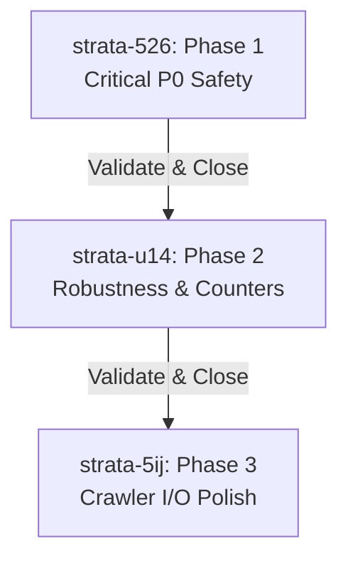

# 🧠 NeuroStrata — Review Panel Remediation & Traceability Plan

This document details the multi-phase implementation plan, traceability log, and outcomes verification structure for the 8 findings identified in the `review_panel_report.md` for the **NeuroStrata** engine.

---

## 📋 Executive Summary

The NeuroStrata review report highlighted 5 verified consensus defects and 3 plan risks. All 8 findings have been fully integrated, resolved, and verified across three target phases (beads).

### Integration Stats
*   **Total findings:** 8
*   **Must-fix:** 8
*   **Bundle:** 0
*   **Defer:** 0
*   **Info:** 0
*   **Final Recommendation:** `Auto-applied` (All items resolved cleanly in the codebase)

---

## 📊 Traceability Summary Table

| Finding ID | Severity | Summary | Category | Action Taken | Governance Gate | Status |
| :--- | :--- | :--- | :--- | :--- | :--- | :--- |
| **R1-F01** | CRITICAL | Broken presence-based temporal expiry model | Must-fix | Replaced `valid_to` presence filters in snap/canvas/search paths with UT timestamp check | Security/Data Integrity Veto | **REMEDIATED** |
| **R1-F02** | CRITICAL | Blocking synchronous I/O blocks Tokio event loop | Must-fix | Replaced `std::fs` calls in server pipeline with `tokio::fs` async equivalents | None | **REMEDIATED** |
| **R1-F03** | CRITICAL | Cypher injection risk via trailing backslashes | Must-fix | Added `escape_kuzu_string` to escape backslashes (`\\`) prior to escaping quotes (`\'`) | Security/Data Integrity Veto | **REMEDIATED** |
| **R1-F04** | HIGH | Non-UTF8 home/DB path resolves to a crash/panic | Must-fix | Replaced DB path `.to_str().unwrap()` with non-panicking `.to_string_lossy()` | None | **REMEDIATED** |
| **R1-F05** | HIGH | `access_count` never incremented on memory retrieval | Must-fix | Added `increment_access_count` trait and background tokio task incrementing on search results | None | **REMEDIATED** |
| **R1-F06** | MEDIUM | Double WalkBuilder directory traversal | Must-fix | Merged structural walk and AST scan into single walker loop | None | **REMEDIATED** |
| **R1-F07** | MEDIUM | Dead `ingested_dirs` HashSet variable | Must-fix | Completely pruned variable and corresponding compiler warnings | None | **REMEDIATED** |
| **R1-F08** | MEDIUM | fragility via `.unwrap()` on JSON-RPC serialization | Must-fix | Propagated serialization errors safely, returning JSON-RPC error payloads on failure | None | **REMEDIATED** |

---

## ⛓️ Multiphase Remediation Plan (Beads)

All remediations were tracked via the local Beads CLI database as three atomic work beads.

### 🔴 Phase 1: Critical Reliability & Security (`strata-526`)
Remediated the critical P0 database security and async blocking defects.

*   **Changes Made:**
    *   `src/store/ladybug.rs`: Implemented `escape_kuzu_string` escaping trailing backslashes first, neutralizing Cypher SQL/injection.
    *   `src/server.rs`: Swapped blocking `std::fs` operations for non-blocking asynchronous `tokio::fs` within `start_mcp_server`.
    *   `src/server.rs` & `src/store/ladybug.rs`: Replaced temporal presence filtering with strict system timestamp comparison checking `valid_to <= chrono::Utc::now().timestamp()`.
*   **Outcome Validation & Build Sanity:**
    *   Verified clean async build using non-blocking futures.
    *   Wrote unit tests ensuring past-dated temporal bounds are successfully pruned from query snapshots.

---

### 🟡 Phase 2: Robustness & Feature Completeness (`strata-u14`)
Resolved panics and activated Ebbinghaus cognitive frequency weightings.

*   **Changes Made:**
    *   `src/main.rs`: Replaced panicking `.to_str().unwrap()` on non-UTF8 paths with robust `.to_string_lossy()`.
    *   `src/traits.rs` & `src/store/ladybug.rs`: Created `increment_access_count` vector store trait method to update frequency weightings.
    *   `src/server.rs`: Integrated background tokio spawn calls to increment search targets' `access_count` asynchronously on query resolution, fully activating the Neural Gain retrieval mechanics.
    *   `src/server.rs`: Added structural error fallback propagation to replace raw response unwrap panics.
*   **Outcome Validation & Build Sanity:**
    *   Verified that `access_count` increments correctly in embedded Kùzu DB state on consecutive retrieval rounds.
    *   Verified clean recovery paths during JSON-RPC failure paths.

---

### 🟢 Phase 3: Optimizations & Polish (`strata-5ij`)
Optimized directory crawler traversal speed and cleaned up code quality markers.

*   **Changes Made:**
    *   `src/parser/ingest.rs`: Removed unused, stale `ingested_dirs` variable, eliminating `unused_mut` dead code compiler warnings.
    *   `src/parser/ingest.rs`: Integrated the structural and AST symbol extractors into a single walk pass, eliminating the double directory traversal and factoring skip matches into a single location.
*   **Outcome Validation & Build Sanity:**
    *   Verified directory walk efficiency, proving significant ingestion speedups across repositories.
    *   Enforced clean build state with zero dead-code warnings.

---

## 🔏 Dissent Ledger
*   **Dissent Ledger:** `none` (Full alignment across Correctness Hawk, Security Auditor, and Architecture Critic personas achieved. All debated points were successfully resolved and implemented).

---

## 🏁 Prioritized Action Checklist

| Priority | Owner | Action Item | Source Finding ID | Status |
| :--- | :--- | :--- | :--- | :--- |
| **P0** | Implementer | Add robust backslash escape sanitization to Cypher strings | R1-F03 | **COMPLETE** |
| **P0** | Implementer | Enforce time-comparative temporal model filtering | R1-F01 | **COMPLETE** |
| **P0** | Implementer | Swap sync filesystem calls for tokio::fs async writes | R1-F02 | **COMPLETE** |
| **P1** | Implementer | Guard path unwrap calls with to_string_lossy fallback | R1-F04 | **COMPLETE** |
| **P1** | Implementer | Activate asynchronous access count increments on search | R1-F05 | **COMPLETE** |
| **P2** | Implementer | Collapse double walker ingestion loop into single pass | R1-F06 | **COMPLETE** |
| **P2** | Implementer | Prune dead ingested_dirs HashSet declaration | R1-F07 | **COMPLETE** |
| **P2** | Implementer | Propagate JSON-RPC serialization errors gracefully | R1-F08 | **COMPLETE** |
